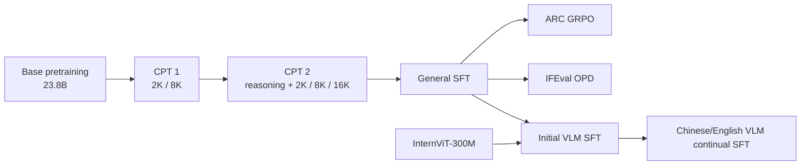

# tinyLLM

tinyLLM 是我从零搭建并训练的一套 0.51B 中英双语小模型。这个项目从 decoder-only Transformer 开始，完整做了预训练、继续预训练、SFT、GRPO、On-Policy Distillation（OPD）和视觉语言训练，最后做成了一个可以在 Windows 16GB 显卡上运行的网页 Demo。

我最初只是想把一个小模型真正训出来，后来陆续补了数学、代码、长上下文、强化学习和视觉。中间踩过不少坑，比如小模型循环解码、教师和学生思维格式不一致、视觉数据偏英文和 OCR、混合 loss 被通用回放压住等。这些问题最后都落到了代码里，而不是只留一个训练结果。

## 结果

| 任务 | 方法 | 基线 | 最终结果 | 提升 |
| --- | --- | ---: | ---: | ---: |
| ARC-Easy | SFT + 规则奖励 GRPO | 30.09% | **35.98%** | **+5.89 pp** |
| GSM8K | SFT checkpoint 50000，1,319 题 greedy | — | **50.64%** | — |
| Google IFEval | SFT + MiniCPM3-4B OPD | 23.74% | **25.18%** | **+1.44 pp** |

IFEval 这里写的是 strict instruction accuracy。其余三项也有提升：strict prompt 14.79% → 15.71%，loose prompt 17.19% → 17.74%，loose instruction 26.86% → 27.70%。评测使用 Google IFEval 的 541 个 prompt、834 条 instruction。

GSM8K 展示的是保留下来的 SFT 基座成绩：668 / 1319。数学强化学习也做过，但最佳权重没有完整留下来，所以 README 里就不拿它充结果了。

## 模型结构

文本模型是自己写的 `nn.Module + GenerationMixin`，不是直接套一个现成的 Transformers 模型。

| 配置 | 数值 |
| --- | --- |
| 参数量 | 约 0.510B |
| Transformer 层数 | 24 |
| hidden size | 1280 |
| attention | 20 query heads / 4 KV heads |
| MLP 宽度 | 3.5× → 4.0× → 4.5×，最后三层 5.0× |
| attention 稳定性 | QK RMSNorm + 可学习 attention temperature |
| 训练上下文 | 2K、8K、16K 分阶段混合 |
| 训练精度 | BF16 |
| 视觉塔 | InternViT-300M-448px-V2_5 |
| 视觉连接 | projector + Q-Former + language LoRA |

LoRA 按任务分别保存，本地 Demo 可以在普通 SFT、ARC、OPD 和 VLM 之间切换。

## 训练中几个真正有用的设计

下面不重复 Transformer、LoRA 或 GRPO 的通用原理，只记录这个项目在训练中遇到问题后留下来的处理。

### 0.51B 的参数没有平均铺在每一层

模型只有 24 层，平均加宽会很快吃完参数预算。我把前 8 层的 MLP ratio 设为 3.5，中间 8 层设为 4.0，第 17～21 层设为 4.5，最后三层再提高到 5.0，把更多 FFN 容量留给后面的语义组合和回答生成。Attention 使用 20 个 query head、4 个 KV head，在 16GB 显卡推理时可以明显压低 KV cache；Q、K 投影后再做 RMSNorm，并给 attention temperature 留一个可学习标量。每层 attention 和 MLP 的残差分支还有限制在固定范围内的独立 gate，避免某个分支在训练早期突然放大。

实现见 [`model/config.py`](model/config.py) 和 [`model/model.py`](model/model.py)。

### 蒸馏没有用教师答案替换原始标签

一开始如果让 4B 教师和 0.51B 学生在线同时跑，显存和吞吐都不合适。实际做法是提前保存 MiniCPM3-4B 每个位置的 top-16 logits，并按学生 `input_ids` 的 hash 写入分片 LMDB；训练时只读取命中的位置。学生始终保留原始 next-token CE，再额外加入温度 1.5、权重 0.2 的 soft-target loss。也就是说，gold token 一直参与训练，教师 top-16 只是补充分布信息，并没有把整道题的最终答案提前塞给学生。代码里还保留了 shortlist 版本：即使 gold 不在教师 top-16，也会被强制放到候选第 0 列。

这样处理还有一个实际好处：教师 logits 只生成一次，后面的预训练可以继续用 DDP，不必常驻第二个模型。对应代码是 [`train/pretrain/build_teacher_logits.py`](train/pretrain/build_teacher_logits.py)、[`train/pretrain/kd_reader.py`](train/pretrain/kd_reader.py) 和 [`train/pretrain/base.py`](train/pretrain/base.py)。

### 数学 token 单独加权，但没有把所有公式符号都抬高

数学数据混入大规模自然语言后，数字和运算符在总 token 中很稀疏，普通 token mean 容易把这部分梯度盖住。CPT 2 和 SFT 因此给数字以及单字符 `+ - * / = ^ % × ÷` 乘 1.2 的 loss 权重。这个 mask 会同时检查 tokenizer 原始 token 和实际 decode 结果，兼容半角、全角和 Unicode 数字。

这里特意没有给所有“像数学”的字符加权：括号只保留 1.05 的轻权重，逗号、句号不加权，`////`、`***`、带字母或 markup 的 token 也会过滤。数学增强只在 reasoning batch 打开，语言回放和验证集关闭，避免为了数学把正常中文标点和文本流畅度一起拉偏。实现见 [`train/pretrain/math_mask.py`](train/pretrain/math_mask.py)。

### 推理和语言回放使用相反的分层学习率

CPT 2 里出现过一个很现实的问题：只加数学数据容易损伤语言能力，平均混合又会让推理梯度被语言 batch 淹没。最后没有只靠固定数据比例，而是把两类更新拆开：每个短周期先做两次 reasoning micro-batch，再单独做一次 language update。

Reasoning 更新的前、中、后层学习率比例是 `0.5 / 0.6 / 1.0`，让上层改得更多；语言更新把它反过来变成 `1.0 / 0.6 / 0.5`，主要用底层去稳住词法和双语表达。训练还会跟踪两类梯度范数的 EMA，每 10 个短周期调整一次语言 loss scale，把 reasoning 的有效梯度占比控制在约 70%，而不是只看两边 loss 的绝对值。旧 checkpoint 中第 4、11、19 层曾使用过 SSM，换回 attention 后先单独热身 2,000 step，再解冻全模型，避免新分支一开始扰动已经学好的层。

这套调度在 [`train/pretrain/cpt_stage2.py`](train/pretrain/cpt_stage2.py) 里，8K 和 16K 样本还分别有 1.10 和 1.20 的短期 loss boost。

### ARC 的 GRPO 重点处理“没有训练信号”和“幸运答对”

ARC 每题生成 16 条候选，里面同时放 greedy、低温和高温采样。低温轨迹已经答对时，高温碰巧答对的样本会降权，避免模型把偶然探索当成稳定策略。只有低温、答案正确、格式完整且长度合适的轨迹才进入最多 256 条的 replay buffer；每 12 个数据 batch 插入一次小权重 CE 回放，用来留住模型自己已经找到的稳定路径。

如果一组候选全部答错，或者 reward 完全没有差异，这道题不会继续计算昂贵的 reference logprob，也不会让空梯度推动 optimizer 和 scheduler。KL 系数则从 0 缓慢升高，到 300 update 才达到设定值。这里解决的是小模型常见的两个问题：大量题目没有正样本，以及高温采样偶然命中后把更新方向带偏。实现见 [`train/grpo/arc.py`](train/grpo/arc.py)。

### OPD 保留学生真实轨迹，也保护自己的思维协议

IFEval OPD 没有只做一遍教师 SFT。每个 global batch 由 10 条学生当前策略生成的轨迹、3 条 verifier 筛过的教师轨迹和 3 条中英文回放组成；训练中再根据三类目标各自的 loss EMA 调整 scale，使它们的实际贡献长期接近 65% / 20% / 15%。学生轨迹让教师在学生真正会到达的状态上给分布，教师轨迹提供稳定的合格路径，通用回放用来防止为了指令遵循损伤日常表达。

教师和学生使用的思维边界并不相同。代码会先找出注入边界对应的完整 token span，只把这些位置从 JSD 中摘掉，而不是简单屏蔽某一个 token；正文和推理内容照常反向传播。这避免了蒸馏过程中把学生原有的思维格式直接压掉。实现见 [`train/opd/ifeval.py`](train/opd/ifeval.py) 和 [`configs/opd_ifeval_shared_65_20_15.json`](configs/opd_ifeval_shared_65_20_15.json)。

### 视觉训练把视觉样本和文本回放分成两次 forward

VLM 继续训练时，纯文本回放不能伪造一个空图片前缀，否则 Q-Former 和 bridge 也会收到没有意义的梯度。混合 batch 会按是否含图拆成两次 forward：视觉样本更新 language LoRA、Q-Former 和 projector，文本样本只经过语言模型，最后再按样本数合并两个 loss。长描述也不能靠 token 数量压过短问答，所以视觉阶段使用 75% sample mean + 25% token mean 的混合归约。

InternViT 特征没有一次性全部落盘。训练只预计算下一个 chunk 需要的五视图特征，随后卸载视觉塔再开始反向传播，到 chunk 边界轮换 LMDB；这样在单卡训练时能同时控制显存和缓存体积。实现见 [`train/vlm/continual.py`](train/vlm/continual.py)。

## 训练路线



整个文本模型大约看过 38.7B token：初始预训练约 23.8B，两段继续预训练约 5.3B 和 9.6B。

### 1. 初始预训练

入口：[`scripts/pretrain.py`](scripts/pretrain.py)

初始预训练用 2048 上下文，per-device batch 3、gradient accumulation 3、4 卡 DDP，峰值学习率 `2.5e-4`，warmup 后 cosine decay。

数据以中文为主，再加入英文、代码和数学：

- `Mxode/Chinese-Instruct` 和清洗后的中文高质量文本；
- `opencsg/chinese-cosmopedia`；
- `ajibawa-2023/Children-Stories-Collection`；
- `nampdn-ai/tiny-codes`；
- `nvidia/OpenCodeInstruct`；
- `nvidia/OpenMathInstruct-2`。

这一阶段同时使用 MiniCPM3-4B 的离线 top-16 logits；gold CE、LMDB 对齐和蒸馏权重的处理见上面的“蒸馏没有用教师答案替换原始标签”。

### 2. 两段继续预训练

- [`scripts/train_cpt_stage1.py`](scripts/train_cpt_stage1.py)：第一段 2K / 8K 混合训练；
- [`scripts/train_cpt_stage2.py`](scripts/train_cpt_stage2.py)：第二段推理、语言和长上下文混合训练。

第一段从 `checkpoint-323180` 开始，每 20 个 2K optimizer step 插入 1 个 8K step，短序列继续使用教师 logits，学习率降到 `1.8e-4`，最后训练到 `checkpoint-396000`。

第二段把短序列拆成两份推理数据和一份语言数据。每 20 个短周期加入一次 8K，每 5 个长序列周期再加入一次 16K；学习率降到 `6e-5`，前、中、后层使用不同的学习率缩放，最后训练到约 `checkpoint-651195`。

数学与推理部分主要用了 OpenMathInstruct-2、NuminaMath-CoT、MetaMathQA、MathInstruct、Orca Math、OpenR1-Math、AceMath、Natural Reasoning，以及多组中文数学和 DeepSeek-R1 蒸馏数据。代码和工具部分用了 OpenCodeInstruct、tiny-codes、When2Call。语言和长文本部分用了 Chinese Cosmopedia、Fineweb-Edu-Chinese、FineWeb-Edu、FineMath、OpenStax、Khan Academy、GovReport、BookSum 和 Research-14K。

更完整的数据对应关系放在 [`docs/TRAINING_DATA.md`](docs/TRAINING_DATA.md)。

### 3. 通用 SFT

入口：[`scripts/train_sft.py`](scripts/train_sft.py)

SFT 从 CPT 最终模型继续训练。短样本最长 2048，长样本最长 16K，每 50 个短序列 step 插入一个长序列 step。训练使用 token-budget 动态 batch、BF16、峰值学习率 `1.5e-5`、warmup 500 step 和 cosine decay。

主要数据包括：

- 数学：OpenMathInstruct-2、NuminaMath-CoT、MetaMathQA、MathInstruct、Orca Math、Natural Reasoning、OpenO1-SFT、OpenThoughts；
- 通用中英文：UltraChat 200K、Helpful Instructions、Dolly 15K、中文 SmolTalk、BiST 翻译；
- 代码与工具：Ling-Coder-SFT、When2Call、Hermes reasoning tool use；
- 长上下文：LongAlign-10k。

后续实验都从 `sft_base_50000` 开始，ARC、GSM8K、IFEval 和 VLM 共用同一个文本底座。

### 4. ARC-Easy GRPO

入口：[`scripts/train_grpo_arc.py`](scripts/train_grpo_arc.py)

ARC 用规则直接验证最终选项，再配合答案格式奖励和 KL 约束更新 LoRA。完整评测从 30.09% 提高到 35.98%，最佳点在 step 200。

[`scripts/train_grpo_gsm8k.py`](scripts/train_grpo_gsm8k.py) 是 GSM8K 数值奖励版本。训练代码保留了，但项目公开结果只写可复现的 SFT 50.64% 基线。

### 5. IFEval On-Policy Distillation

入口：

- [`scripts/prepare_opd_data.py`](scripts/prepare_opd_data.py)
- [`scripts/build_opd_teacher_pool.py`](scripts/build_opd_teacher_pool.py)
- [`scripts/train_opd_ifeval.py`](scripts/train_opd_ifeval.py)
- [`scripts/evaluate_opd_ifeval.py`](scripts/evaluate_opd_ifeval.py)

任务数据是 `allenai/RLVR-IFeval`。14,973 条原始记录清洗后保留 14,690 条，其中 14,210 条训练、480 条开发集，覆盖 24 类指令约束。

教师使用 MiniCPM3-4B。教师先生成候选，只有通过 IFEval verifier、没有循环、没有撞到输出上限的回答才进入教师池。最后得到 6,583 条合格教师轨迹。

训练使用上面介绍的 65% 学生轨迹、20% 合格教师轨迹和 15% 中英文回放。中文回放来自 `m-a-p/COIG-CQIA`，英文来自 `HuggingFaceTB/smoltalk2` 的 everyday conversations。LoRA 为 rank 64 / alpha 64，覆盖 attention 和 MLP，跳过最前四层；峰值学习率 `1.2e-6`，warmup 60 step，共三轮。

最终用 Google IFEval 做全量评测，strict instruction accuracy 从 23.74% 提高到 25.18%。

### 6. VLM：先做视觉对齐，再补中文日常看图

初始入口：[`scripts/train_vlm_initial.py`](scripts/train_vlm_initial.py)

第一轮视觉 SFT 打包了 845,755 条样本和约 243.8M 文本 token。数据主要来自 LLaVA-OneVision 的 DocVQA、ChartQA、DVQA、FigureQA、GeoQA、ScienceQA 等子集，也加入了 LLaVA-CoT-100k 和 LLaVA instruct mix。

这批数据把视觉前缀和语言模型接通了，但它太偏英文、图表、OCR 和学术题。实际演示时英文回答还可以，中文日常看图和普通物体描述容易幻觉。所以第二轮没有继续堆表格 OCR，而是重新补中文短问答、图片描述和多轮视觉对话。

| 数据 | 训练条数 | 用途 |
| --- | ---: | --- |
| FM-IQA | 81,148 | 中文短问答、物体和场景识别 |
| M3IT COCO-CN | 17,865 | 中文图片描述 |
| M3IT Flickr8k-CN | 5,789 | 中文日常场景描述 |
| Pangea 中文多轮 | 44,019 | 围绕同一张图连续对话 |
| VQAv2 | 18,998 | 英文短问答 |
| CogVLM detail/multi/single，中英 | 33,929 | 细节描述、单轮和多轮补充 |

清洗后共有 **201,748 条视觉训练样本和 4,730 条视觉验证样本**。每条只保留一张源图，处理成四张有重叠的局部图和一张全局缩略图，统一为 448×448。上游的各种图片占位符会先删掉，只在第一轮 user 消息开头放一个规范 ``。超过 2048 token、多张源图、角色顺序错误或图片路径失效的样本会被过滤。

继续训练沿用原来的视觉 LoRA，rank / alpha 调到 128 / 128。InternViT 保持冻结，训练 language LoRA、Q-Former 和 projector：

| 模块 | 学习率 |
| --- | ---: |
| Language LoRA | `8e-6` |
| Q-Former | `1.2e-5` |
| Projector / bridge | `1.5e-5` |

视觉数据之外加入 20% 纯文本回放，中文和英文约 2:1；具体的分路 forward 在上面已经说明。训练两轮，3% warmup、cosine decay、weight decay 0.01、gradient clip 1.0。最终选择 step 18000，visual eval loss `2.8359`，text replay loss `3.1927`。

```powershell
python scripts/prepare_vlm_data.py --start-preparation
python scripts/audit_vlm_data.py
python scripts/train_vlm_continual.py --start-training
```

## 本地 Demo

按 [`docs/MODEL_RELEASE.md`](docs/MODEL_RELEASE.md) 放好权重，然后复制 `configs/models.example.json` 为 `configs/models.json`，填写本机路径。Windows 可以直接双击 `start_demo.cmd`，也可以运行：

```powershell
python chat_server.py --port 8501
```

打开 `http://127.0.0.1:8501`。网页支持流式输出、KaTeX 公式渲染、图片上传和模型切换。默认解码加入 repetition penalty、no-repeat n-gram、循环片段检测和提前停止，主要用来防止 0.5B 模型在演示时反复生成同一句话。

上传新图片时会开启新的图片上下文，不把上一张图一起送进模型。这与训练时的单图格式一致，也能避免旧图片污染新回答。

不下载权重也可以打开 [Hugging Face 在线 Demo](https://huggingface.co/spaces/chris0809/tinyLLM-Demo)。它使用免费 ZeroGPU，主要展示 SFT 文本基座；第一次唤醒需要排队，完整的图片和多 LoRA 切换仍以本地 Demo 为准。

## 权重下载

Hugging Face 保存可版本化加载的模型和 LoRA，百度网盘提供国内镜像：

- [tinyLLM-0.51B-SFT](https://huggingface.co/chris0809/tinyLLM-0.51B-SFT)：文本基座；
- [tinyLLM-0.51B-ARC-GRPO](https://huggingface.co/chris0809/tinyLLM-0.51B-ARC-GRPO)：ARC-Easy GRPO LoRA；
- [tinyLLM-0.51B-IFEval-OPD](https://huggingface.co/chris0809/tinyLLM-0.51B-IFEval-OPD)：IFEval OPD LoRA；
- [tinyLLM-0.51B-VLM](https://huggingface.co/chris0809/tinyLLM-0.51B-VLM)：语言模型、Q-Former、projector 和视觉 LoRA。冻结的视觉塔直接引用 [InternViT-300M-448px-V2_5](https://huggingface.co/OpenGVLab/InternViT-300M-448px-V2_5)。

文本基座已经注册到 Transformers 的 `AutoModelForCausalLM`：

```python
from transformers import AutoModelForCausalLM, AutoTokenizer

model_id = "chris0809/tinyLLM-0.51B-SFT"
tokenizer = AutoTokenizer.from_pretrained(model_id)
model = AutoModelForCausalLM.from_pretrained(
    model_id,
    trust_remote_code=True,
    dtype="auto",
)

# 可选：热加载某一个任务 LoRA
model.load_lora_pretrained("chris0809/tinyLLM-0.51B-ARC-GRPO")
```

完整的导出、LoRA 切换和 VLM 加载方法见 [`docs/HUGGINGFACE.md`](docs/HUGGINGFACE.md)。

国内镜像：

- [下载 tinyLLM-release-20260908](https://pan.baidu.com/s/1rpM9mtMbtyq01GluLk72NA?pwd=tjda)
- 提取码：`tjda`

其中包含 SFT 基座、ARC GRPO LoRA、GSM8K OPD 实验 LoRA、VLM step 18000、InternViT-300M 和发布清单。文件大小、SHA-256 和放置目录见 [`docs/MODEL_RELEASE.md`](docs/MODEL_RELEASE.md)。

## 目录

```text
configs/          训练、模型和解码配置
data_preprocess/  文本数据构建、视觉清洗与五视图构建
eval/             ARC、GSM8K 和视觉评测
inference/        文本、多 LoRA、视觉推理与解码保护
model/            tinyLLM、LoRA、Q-Former 和视觉连接层
scripts/          每个训练阶段的入口
third_party/      固定版本的 IFEval verifier
tools/            OPD 教师池、数据审计与权重导出
train/            预训练、CPT、SFT、GRPO、OPD 和 VLM 核心代码
ui/               本地网页界面
```

旧云端真正使用过的两段 CPT、KD LMDB、文本 packer、第一轮 VLM SFT 和视觉特征缓存代码都已经整理回 `train/`。反复试跑的临时启动器、空探针和机器恢复脚本没有放进公开仓库。

## 环境

推荐 Python 3.10、PyTorch 2.x 和支持 BF16 的 NVIDIA GPU。Windows 验证环境见 [`docs/windows_verified.json`](docs/windows_verified.json)。

```powershell
python -m venv .venv
.\.venv\Scripts\Activate.ps1
pip install -r requirements.txt

python -m compileall -q .
python -m unittest tests.test_decoding_safety tests.test_grpo_reward_regression -v
```

0.51B 的容量更适合短数学题、格式约束、常见物体和场景描述。密集表格 OCR、很长的复杂推理和多图联合理解目前还不稳定；这个 Demo 主要展示的是一条完整的小模型训练与部署链。
