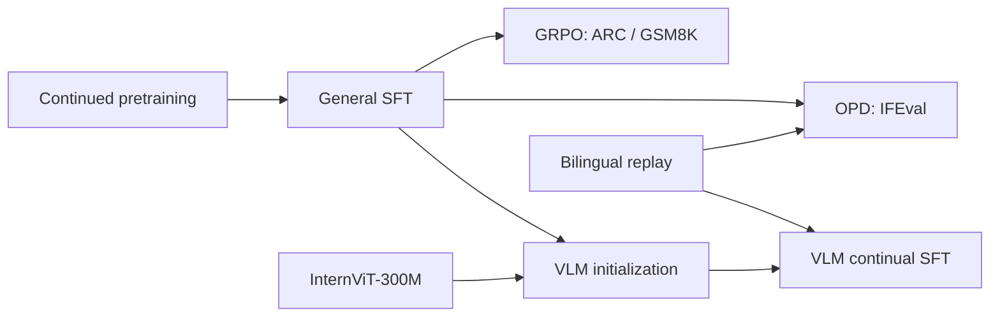

# tinyLLM

tinyLLM 是一个约 0.51B 参数的中英双语语言模型实验项目，覆盖预训练、监督微调、规则奖励强化学习、On-Policy Distillation（OPD）以及视觉语言扩展。仓库保留最终训练路径和可复现评测，模型权重与训练数据单独发布。

项目的重点不是追求通用大模型的绝对分数，而是在有限算力下完成一条可解释、可验证的后训练链路：

- 自定义 decoder-only Transformer：24 层、隐藏维度 1280、20 个查询头与 4 个 KV 头；
- LoRA 热加载，可在 SFT、ARC、OPD 和 VLM 适配器之间切换；
- 规则可验证的 GRPO，用于 ARC-Easy 和 GSM8K；
- MiniCPM3-4B 教师参与的 OPD，结合学生在线轨迹、验证通过的教师轨迹和中英文回放；
- InternViT-300M + projector + Q-Former 的视觉分支；
- 本地网页演示，支持流式输出、数学公式渲染和循环解码保护。

## 结果

所有数字均来自已有完整评测或历史 TensorBoard 记录。不同任务的指标不能横向比较。

| 任务 | 方法与协议 | 基线 | 最佳结果 | 变化 |
| --- | --- | ---: | ---: | ---: |
| ARC-Easy | 规则奖励 GRPO，历史完整评测 | 30.09% | **35.98%** | **+5.89 个百分点** |
| GSM8K | 规则奖励 GRPO，历史完整评测 | 50.49% | **51.40%** | **+0.91 个百分点** |
| Google IFEval | 541 prompts、834 instructions、greedy、1024 输出 token | 严格 instruction 23.74% | **25.18%** | **+1.44 个百分点** |

IFEval 的其余指标为：严格 prompt 14.79% → 15.71%，宽松 prompt 17.19% → 17.74%，宽松 instruction 26.86% → 27.70%。最佳结果来自 OPD epoch 3。

GSM8K 的 2026 OPD 对照实验没有得到正向提升：相同 1,319 题协议下，SFT 基线为 50.64%，stage 2 为 50.27%，stage 3 为 50.49%。这个结果保留在仓库中作为负向实验，不用于宣传 OPD 收益。详细机器可读结果见 [`docs/RESULTS.json`](docs/RESULTS.json)。

> 权重可用性说明：ARC 最佳适配器、SFT 基座和 VLM step 18000 已保存在本地。历史 GSM8K 最佳适配器和 IFEval OPD epoch 3 适配器没有从已退役的云实例取回，因此对应数字只能作为有日志依据的历史结果，不能声称当前下载包可直接复现。

## 训练流程



### 1. 预训练

[`scripts/pretrain.py`](scripts/pretrain.py) 调用最终预训练实现。代码支持因果语言建模、教师 logits 蒸馏和断点保存。训练数据与教师缓存不进入 GitHub。

### 2. 监督微调

[`scripts/train_sft.py`](scripts/train_sft.py) 运行通用 SFT。后续所有可控实验都以 `sft_base_50000` 为统一基线，避免在不同底座之间误比较。

### 3. GRPO

- [`scripts/train_grpo_arc.py`](scripts/train_grpo_arc.py)：ARC-Easy 规则奖励训练；
- [`scripts/train_grpo_gsm8k.py`](scripts/train_grpo_gsm8k.py)：GSM8K 数值答案规则奖励训练。

奖励函数、答案解析和 LoRA 更新位于 `train/GRPO_ARC.py` 与 `train/GRPO.py`。ARC 的最佳历史 checkpoint 是 step 200，而不是最后一步。

### 4. IFEval OPD

OPD 使用三路目标，配置见 [`configs/opd_ifeval_shared_65_20_15.json`](configs/opd_ifeval_shared_65_20_15.json)：

| 目标 | 目标损失占比 | 作用 |
| --- | ---: | --- |
| 学生在线轨迹蒸馏 | 65% | 在学生自己的状态分布上对齐教师分布 |
| 验证通过的教师轨迹 | 20% | 提供稳定、满足规则的正向轨迹 |
| 中英文通用 SFT 回放 | 15% | 限制指令训练造成的语言能力退化 |

训练使用 rank 64 LoRA，蒸馏温度 1.0，JSD `beta=0.5`，峰值学习率 `1.2e-6`，60 个 optimizer step warmup，梯度裁剪 1.0。教师池只接收通过 IFEval verifier、无循环且没有撞到输出上限的轨迹。学生思维边界对应的 token span 会从教师 JSD 中屏蔽，避免协议差异压掉学生已有的思维格式。

依次运行：

```powershell
python scripts/prepare_opd_data.py
python scripts/build_opd_teacher_pool.py
python scripts/train_opd_ifeval.py --dry-run
python scripts/train_opd_ifeval.py
python scripts/evaluate_opd_ifeval.py --training-report runs/training/<run>/report.json
```

最后一步使用 Google 官方 IFEval verifier 做完整评测；开发集只用于 checkpoint 选择。

### 5. VLM 持续训练

视觉链路把一张原图处理为四张重叠局部图和一张全局缩略图。InternViT 提取五视图特征，projector 将视觉维度映射到语言隐藏维度，Q-Former 压缩视觉信息后作为视觉前缀送入语言模型。

最终训练集包含 201,748 条视觉训练样本、4,730 条视觉验证样本，并加入 20% 文本回放。文本回放按中文与英文 2:1 采样；文本样本走独立的纯文本 forward，不携带 ``。视觉塔冻结，训练 language LoRA、Q-Former 和 bridge：

| 部分 | 学习率 |
| --- | ---: |
| Language LoRA，rank 128 | `8e-6` |
| Q-Former | `1.2e-5` |
| Bridge / projector | `1.5e-5` |

其余设置为 3% warmup、cosine decay 到峰值的 10%、weight decay 0.01、梯度裁剪 1.0、BF16。最终选择 step 18000：visual eval loss `2.8359`，text replay loss `3.1927`。

准备和训练入口：

```powershell
# 默认只做容量检查，不处理数据
python scripts/prepare_vlm_data.py

# 审核配置和磁盘空间后，开始预处理
python scripts/prepare_vlm_data.py --start-preparation

# 默认只做模型、数据、显存检查
python scripts/train_vlm_continual.py

# 将 configs/vlm_continual_zh_en_v5.json 中 training_enabled 改为 true 后启动
python scripts/train_vlm_continual.py --start-training
```

数据清洗只保留单原图样本，删除上游图片占位符，再把一个规范 `` 放到第一轮用户消息开头；助手答案中的图片标记会被移除。总长度超过 2048 token 的样本被过滤。`scripts/audit_vlm_data.py` 可在训练前抽样检查图片映射、消息交替和 token 化结果。

## 本地演示

1. 安装依赖；
2. 按 [`docs/MODEL_RELEASE.md`](docs/MODEL_RELEASE.md) 放置权重；
3. 复制 `configs/models.example.json` 为 `configs/models.json`，按实际目录调整；
4. Windows 双击 `start_demo.cmd`，或运行：

```powershell
python chat_server.py --port 8501
```

打开 `http://127.0.0.1:8501`。上传新图片会建立新的图片上下文；旧对话仍显示在浏览器中，但不会连同新图片一起送入模型。这样与单图训练分布一致，也避免前一张图片污染当前回答。

推理配置位于 [`configs/decoding.json`](configs/decoding.json)。默认采用保守采样、重复惩罚、no-repeat n-gram 和循环检测；数学公式由 KaTeX 在浏览器端渲染。

## 环境

推荐 Python 3.10 和支持 BF16 的 NVIDIA GPU。验证过的 Windows 环境记录在 [`docs/windows_verified.json`](docs/windows_verified.json)。

```powershell
python -m venv .venv
.\.venv\Scripts\Activate.ps1
pip install -r requirements.txt
```

在 Linux 上使用同一组相对路径即可。`TINYLLM_ROOT` 可以覆盖项目根目录；`TINYLLM_PYTHON` 可以指定 Windows 启动器使用的解释器。

提交前使用以下命令检查 Python 语法和核心回归测试：

```powershell
python -m compileall -q .
python -m unittest tests.test_decoding_safety tests.test_grpo_reward_regression -v

# 可选的网页渲染测试
npm ci --prefix tests/dom
node tests/test_math_render.cjs
```

## 目录

```text
configs/          训练、推理和模型注册配置
data_preprocess/  多模态清洗与五视图构建
eval/             ARC、GSM8K 和 VLM 评测
inference/        文本、多 LoRA 和图像推理
model/            tinyLLM 主体、LoRA 与视觉桥接结构
scripts/          按阶段整理的公开入口
third_party/      固定版本的 IFEval verifier
tools/            数据准备、审计和权重导出工具
train/            训练核心实现
ui/               本地网页演示
```

原始实验的 `v1/v2/v3` 启动器、临时恢复脚本、缓存和重复文件没有进入本仓库。发布版保留最终 IFEval OPD 路径与 VLM continual v5 路径；历史代码仍保存在维护者的本地归档中。

## 权重发布

GitHub 只保存代码。模型权重建议发布到 Hugging Face 或 ModelScope，并把百度网盘作为国内镜像。每个发布包应固定版本、列出所需基座、附 SHA-256，并与 `configs/models.example.json` 的目录一致。当前本地可发布内容、精确大小和校验值见 [`docs/MODEL_RELEASE.md`](docs/MODEL_RELEASE.md)。

当前 `TinyLLM` 是项目自定义的 `nn.Module + GenerationMixin` 架构，权重仓库可以正常保存全部代码、配置、tokenizer 和参数，但还没有实现 Transformers 的 `PreTrainedModel` / `AutoModel` 注册。因此现阶段请使用本项目的 `model/` 与 `inference/` 加载器；不能把模型仓库地址直接传给 `AutoModel.from_pretrained(..., trust_remote_code=True)`。这项兼容层可以后续单独补充，不影响本仓库训练和演示。

## 限制

- 0.51B 参数量限制了复杂数学推理、密集 OCR 和细粒度图像理解；
- VLM 主要面向单图物体、场景和短问答，不能把表格读取能力当作已解决；
- IFEval 和历史 GSM8K 最佳适配器没有从退役云实例取回；
- VLM step 18000 由验证损失选择，目前没有公开综合视觉 benchmark 分数。

这些限制保留在项目说明里，避免把局部评测提升描述成通用能力提升。
