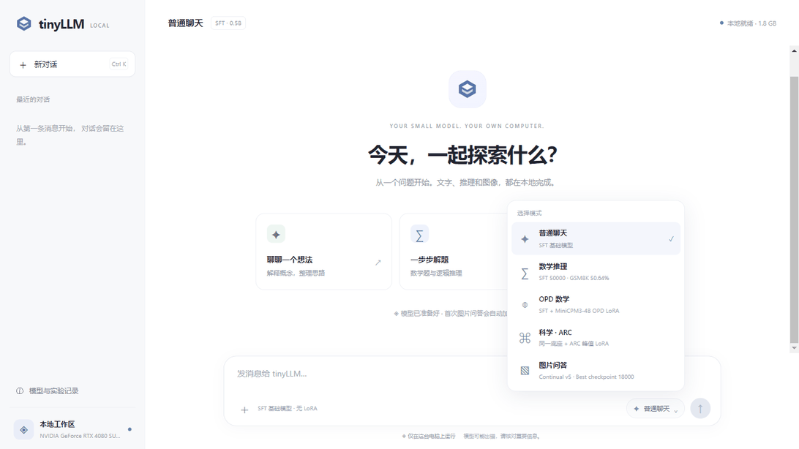
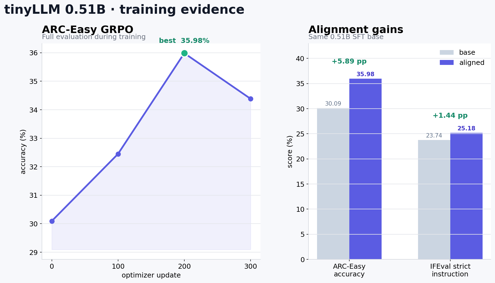
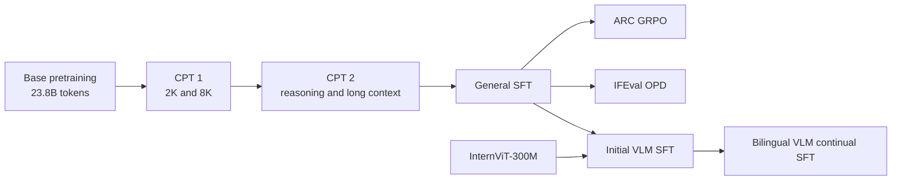

# tinyLLM

<p align="center">
  <a href="README.md">简体中文</a> · <b>English</b>
</p>

<p align="center">
  
  
  
  <a href="https://huggingface.co/spaces/chris0809/tinyLLM-Demo"></a>
</p>

<p align="center">
  
</p>

<p align="center"><i>A real local VLM run: five-view image encoding, streaming output, and decoding guards on Windows.</i></p>

**tinyLLM is a 0.51B bilingual small language model trained from scratch.** The repository covers base pretraining, continued pretraining, supervised fine-tuning, GRPO, on-policy distillation, LoRA adapters, vision-language alignment, evaluation, and a local web demo. It is built for studying the full training stack of a tiny LLM instead of wrapping an existing pretrained model.

> **Try it online:** [Hugging Face Space](https://huggingface.co/spaces/chris0809/tinyLLM-Demo)  
> The free Space focuses on the SFT text model. The local demo adds image input and hot-swappable ARC, IFEval, and VLM adapters.

Keywords: **0.5B model**, small language model, tiny LLM, LLM from scratch, Chinese LLM, bilingual LLM, GRPO, on-policy distillation, knowledge distillation, LoRA, multimodal LLM, vision-language model, local inference.

## Results

<p align="center">
  
</p>

| Evaluation | Method | Base | Aligned | Gain |
| --- | --- | ---: | ---: | ---: |
| GSM8K, 1,319 problems, greedy | General SFT | — | **50.64%** | — |
| ARC-Easy | GRPO | 30.09% | **35.98%** | **+5.89 pp** |
| Google IFEval strict instruction | MiniCPM3-4B OPD | 23.74% | **25.18%** | **+1.44 pp** |

The ARC curve comes from the preserved TensorBoard run and peaks at update 200. IFEval uses Google's 541 prompts and 834 instructions.

## What is included

- A custom decoder-only `nn.Module + GenerationMixin`, not a renamed Transformers checkpoint.
- About 38.7B training tokens across base pretraining and two continued-pretraining stages.
- Offline top-16 knowledge distillation from MiniCPM3-4B while retaining gold-token CE.
- Separate reasoning and language updates with opposite layer-wise learning-rate scales.
- ARC-Easy GRPO with verified-answer rewards and replay of stable successful trajectories.
- IFEval on-policy distillation over student-generated prefixes plus verified teacher trajectories.
- A frozen InternViT-300M vision encoder with Q-Former, projector, and language LoRA.
- A Windows web UI with streaming output, KaTeX, image upload, adapter switching, and repetition guards.

## Model

| Item | Value |
| --- | --- |
| Parameters | approximately 0.510B |
| Transformer blocks | 24 |
| Hidden size | 1,280 |
| Attention | 20 query heads / 4 KV heads |
| MLP ratio | 3.5x → 4.0x → 4.5x, final three blocks 5.0x |
| Context training | staged 2K / 8K / 16K |
| Vision encoder | InternViT-300M-448px-V2_5 |
| Vision bridge | projector + Q-Former + language LoRA |

The wider late MLP blocks reserve more of the parameter budget for semantic composition and answer generation. GQA reduces KV-cache pressure for local inference. QK RMSNorm, a learnable attention temperature, and bounded residual gates were retained for training stability.

## Training path



The initial model was trained mainly on Chinese text, with English, code, and math mixed in. Sources include Chinese-Instruct, Chinese Cosmopedia, OpenCodeInstruct, OpenMathInstruct-2, NuminaMath-CoT, MetaMathQA, UltraChat, SmolTalk, and long-context corpora. See [TRAINING_DATA.md](docs/TRAINING_DATA.md) for the stage-by-stage mapping.

The VLM continual stage uses 201,748 training samples and 4,730 validation samples after filtering. Each record contains one source image, converted into four overlapping crops and one global view. The mix emphasizes Chinese visual QA, everyday object recognition, scene descriptions, and image-grounded multi-turn dialogue. Text-only bilingual replay remains on a separate forward path so it does not create a fake image prefix.

## Alignment details

**GRPO.** Each ARC question produces greedy, low-temperature, and exploratory candidates. Only correct, well-formed, reasonably sized low-temperature traces enter the replay buffer. All-wrong groups and zero-variance reward groups skip the expensive reference-logprob path. The reward requires a correct option before reasoning length can add value, so a long wrong answer cannot score.

**On-policy distillation.** The student first generates its own IFEval response. Teacher and student distributions are compared on that student prefix even when the answer is wrong, which exposes states the student actually visits. Verified teacher-complete trajectories are mixed in because token-level correction on an already-wrong prefix does not show the student a full successful solution. Effective loss shares track approximately 65% student trajectory, 20% teacher trajectory, and 15% bilingual SFT replay.

**VLM continual training.** Early visual training over-weighted long OCR and chart responses and produced verbose hallucinations. The later stage moved toward everyday images and changed reduction to 75% sample mean plus 25% token mean. This reduced the incentive for a long caption to dominate several short visual questions.

## Quick start

Python 3.10, PyTorch 2.x, and a BF16-capable NVIDIA GPU are recommended.

```powershell
git clone https://github.com/Huanz86251/tinyLLM.git
cd tinyLLM
python -m venv .venv
.\.venv\Scripts\Activate.ps1
pip install -r requirements.txt
pip install -U huggingface_hub
hf download chris0809/tinyLLM-0.51B-SFT --local-dir models\text\sft_base_50000
Copy-Item configs\models.huggingface.example.json configs\models.json
python chat_server.py --port 8501
```

Open `http://127.0.0.1:8501`. Download the VLM checkpoint and InternViT encoder when image input is needed. See [HUGGINGFACE.md](docs/HUGGINGFACE.md) for model loading, adapter switching, and VLM examples.

Enable the trained reasoning protocol through the tokenizer template:

```python
inputs = tokenizer.apply_chat_template(
    messages,
    enable_thinking=True,
    add_generation_prompt=True,
    return_tensors="pt",
)
```

## Model weights

- [tinyLLM-0.51B-SFT](https://huggingface.co/chris0809/tinyLLM-0.51B-SFT)
- [tinyLLM-0.51B-ARC-GRPO](https://huggingface.co/chris0809/tinyLLM-0.51B-ARC-GRPO)
- [tinyLLM-0.51B-IFEval-OPD](https://huggingface.co/chris0809/tinyLLM-0.51B-IFEval-OPD)
- [tinyLLM-0.51B-VLM](https://huggingface.co/chris0809/tinyLLM-0.51B-VLM)
- [Baidu Netdisk mirror](https://pan.baidu.com/s/1rpM9mtMbtyq01GluLk72NA?pwd=tjda), extraction code `tjda`

## Scope

At 0.51B parameters, the model is best used for short math problems, constrained output, common-object recognition, and local deployment experiments. Dense table OCR, long multi-step reasoning, and multi-image understanding are outside the main target of this release.